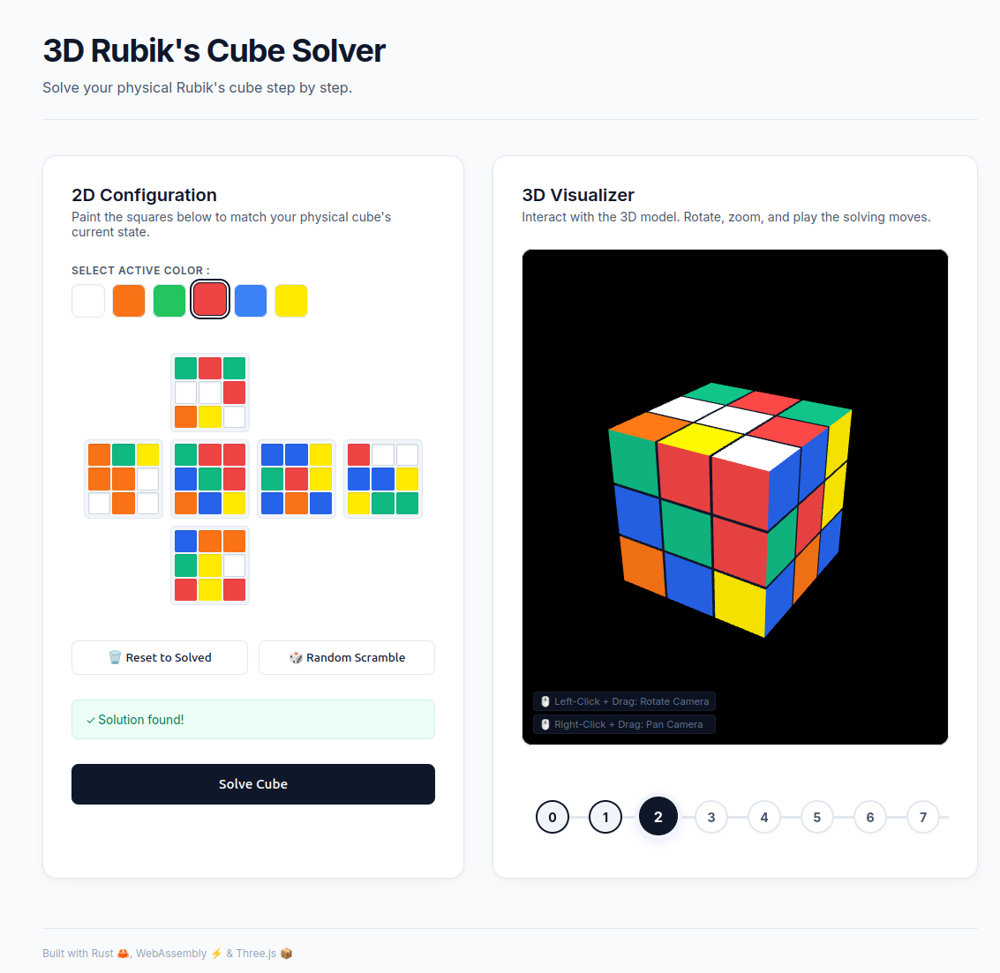

# Rubik's Cube Solver (WebAssembly & 3D)

A fast, interactive 3D Rubik's Cube solver. It combines **Rust & WebAssembly** for high-performance solving (Kociemba algorithm) and **Three.js** for 3D rendering.

**⚡ Live Demo: [https://dmachard.github.io/cube-solver-wasm/](https://dmachard.github.io/cube-solver-wasm/)**



> This project is a vibe coding project with Antigravity editor.

---

## ✨ Features

- **Interactive 3D Visualizer**: Rotate, zoom, and inspect the cube using mouse or touch controls (Three.js).
- **Intuitive 2D Editor**: Paint the cube facelet by facelet with real-time configuration validation.
- **Animations**: Slice rotations
- **Step-by-Step Playback**: Moves timeline and counters

---

## 🚀 Quick Start

### Prerequisites
Make sure you have [Rust & Cargo](https://rustup.rs/), [wasm-pack](https://rustwasm.github.io/wasm-pack/installer/), and `python3` installed.

### 1. Build the WebAssembly module
Compile the Rust code to Wasm:
```bash
make build
```

### 2. Start the local server
Start the lightweight Python server which handles CORS and Wasm MIME-types:
```bash
python3 serve.py
```

### 3. Open the App
Go to: **[http://localhost:8080](http://localhost:8080)**

---

## 🛠️ Development

- **Run tests**: `make test`
- **Check code syntax**: `make check`
- **Clean builds**: `make clean`

---

## 📂 Project Structure

- `src/` - Rust source code (Kociemba solver bindings)
- `js/` - Modular JavaScript logic (3D rendering, animations, state, editor)
- `index.html` & `style.css` - Responsive UI layout and styling
- `app.js` - Main orchestrator and Wasm entry point
- `serve.py` - Local development server